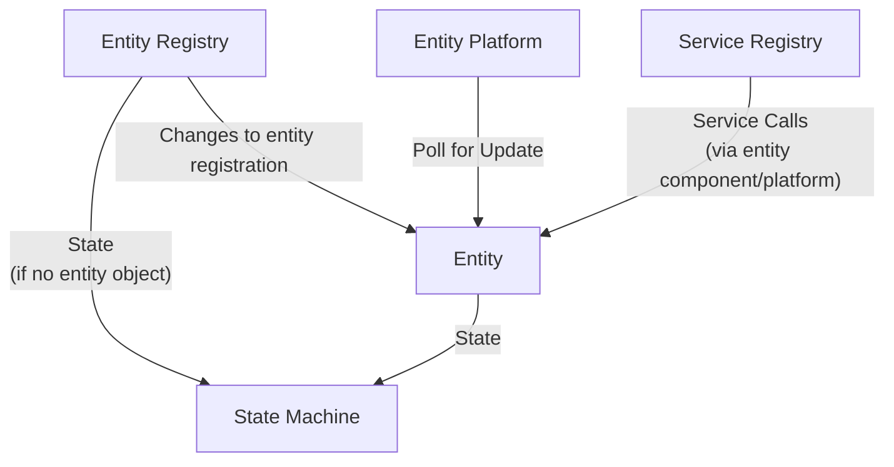
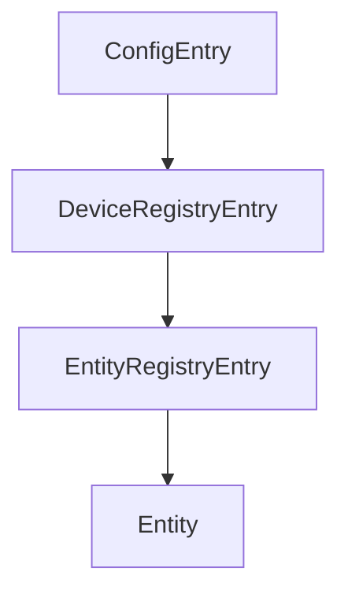
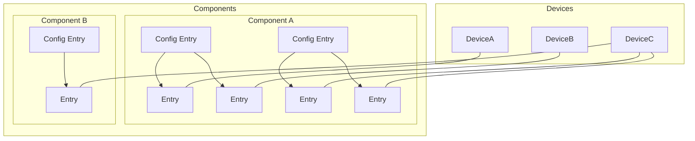

# 全屋智能还是全无智能,智能产品还是智障"产品"(服务)

要注意区分产品和服务,产品才是自己的,服务是别人的,是可以随时改变条款的. 不要花大价钱,买回一堆服务.

## 一点废话

现在越来越多"智能"产品,都要求注册/登陆后才能使用, 这不荒唐么,这是什么产品,还是服务?

听上去全屋智能高达上,其实只是是换了个词忽悠.你兴匆匆的东看看西看看,这家这个不错,便宜;那家那个功能强,都提全屋智能了,那还不赶紧随便挑.
嘿嘿,那你就想错了,各家是各家的,各家设备彼此是无法直接沟通的,没有互联互通,谈不上智能,唯有智障,弄一大堆按钮铺满在手机上遥控就是智能?

更可恶的是,他们不仅仅是正大光明的控制并窃取用户隐私信息,而且他们随时都有能力把"全屋智能"变成全屋智障: 只要他们中断互联网服务!

设备所采集的传感数据和大部分的控制指令都要先到他们的云上走一圈才会执行.他们非常自豪感觉牛逼:你家发生的事情,我们最先知道!
而且你不能说不,如果你说不,主动切断互联网,那么大部分智能设备就都歇菜了!

他们是如此的理直气壮,哪怕你不在家,我们也能让你知道家里发生的事情,我们还能帮你记录家里的事情,你看我们多好,我们的产品多先进,多智能!
这是产品?这TM明明是服务!无时无刻的在偷换概念. 这就好像你去买了房子,他们不仅不把房门钥匙交给你,还随时到房间里面想看就看.这多好,要啥钥匙,
这样你们都不用自己开门了,我们随叫随到给你开门,而且屋子里有任何动静我们都能通知你.

这样就叫"全智能"?这样买的又是啥设备,空气? 难道真的以为用户是羊,通过这样的办法就能把用户赶进自家的大桶里.题外话,尽管打破厂家壁垒互联互通的[Matter协议](https://csa-iot.org/zh-CN/编辑部/智能家居创新将加速-matter/)提了许久,如今国内有多少智能商家落实下去了?

业主应该也必须**拥有**所有智能设备产生的各种数据以及完全的控制智能设备,这是全屋智能的前提. 否则这所谓的智能就没啥事,充其量只能算对方提供的服务,你还要倒掏腰包把对方施行服务的产品先行买下,然后作为他们的测试人员,感受并不完美的"智能":遥控,场景遥控,他们则采集各种数据就成了他们提升自身服务品质的关键,同时作为提价的手段,最后把数据打包销售.

诚然,不用记录管理自己的设备,简单方便,但后果呢...,那还会是你的设备么?

感谢开源的曙光,正义的骑士,一系列的开源智能家居设备管理软件:`Home Assistant`,让我们能够能真正掌握拥有智能设备,拥有它,所谓的全屋智能才有了可能.

## HomeAssistant

HomeAssistant是一个非常聪明的小家伙，它可以通过连接各种[厂家设备](https://www.home-assistant.io/integrations)(截至2021年9月HA已经支持了超过1500个厂家和品牌的设备)和服务来帮助你自动化你的家居生活。它就像是一个家庭管家，可以管理你的灯光、温度、媒体设备等等。你可以告诉它你的喜好，它就会在你需要的时候自动调整，为你提供最舒适的居住体验。

其次，HomeAssistant非常容易上手，因为它有一个非常友好的用户界面，你甚至不需要太多的技术知识。只要你会点基础的电脑操作，就可以轻松掌握。

最后，HomeAssistant是一个非常有趣的小伙伴。它可以与你进行对话，让你感觉就像是在跟一个智能机器人交流一样。你可以给它下指令，它就会立刻回应。这真是太酷了！

所以，如果你想要一个智能家居系统，不妨考虑一下HomeAssistant。它不仅聪明、易用，而且还非常有趣。它会成为你家庭生活中不可或缺的一部分，给你带来更加便利和舒适的居住体验。

## 我为啥要用开源HA

自从开始使用[Home Assistant](https://www.home-assistant.io/)(简称`HA`)1个多月了,陆陆续续买了一些硬件, 在这里把使用过程中碰到的一些坑做个总结,先从HA硬件开始再说软件.

首先说说目的,我为啥用开源HA,而不是图省事,直接用米家桶或HomeKit,主要目的是希望把硬件掌握在自己手中,而不是厂家手中,不想要厂家来替我开关,这牵涉到:

* 必须登陆注册才能使用
* 必须与互联网连接才能使用
* 安全:外网下厂家可随时操控家中设备，智能音箱随时监听说话，摄像头的所谓遮挡也可以远程打开，家里的电器特别是厨房大功率电器如果被人远程控制干烧还很危险的，生活作息习惯也被人分析,还记得手机上的银行AI人脸识别,背后的员工都看不下去,提醒大家注意着装,别裸.
  * [App人脸识别不是只拍脸？专家揭秘审核后台能看到啥](https://www.163.com/dy/article/GE1LD4T905129QAF.html)
  * 使用开源的HA智能家居平台，你可以更加安全地控制自己的设备。由于HomeAssistant是开源的，所有的代码和数据都存储在你自己的设备中，你可以更加掌控自己的数据和隐私。
* 速度问题,所有设备都要经过网络云上中转下，慢一拍
* 断网成智障,不仅如此有的还成废铁
* 自动化难以使用,只能适用简单场景,无法根据各家实际情况调整编程,说白了能用只有云上遥控和场景.
* 产品实质上掌握在厂家手里,他只要停止服务,产品立马变废铁.方不方便是厂家说了算,你说了不算,不会为你一个人改变.
* 软件封闭(非开源)无法审计,HomeKit虽然稍好一点(能够保障离线可用),但实质也一样,HomeKit软件并没有开源,只要软件停止更新,那么等软件在新系统上无法使用,离线也就玩完.
* 选择产品范围受到限制:被困于米家桶或HomeKit.
  * 使用开源的HA智能家居平台，你可以自由地选择你想要的硬件设备，不受任何厂家的限制。无论是灯光、温度传感器、安防设备，还是音频视频设备，你都可以自由选择符合自己需求的品牌和型号，并且在HomeAssistant平台上进行自由组合和控制。
* 无法自由地定制和修改设备的控制逻辑.
  * 使用开源的HA智能家居平台，你可以自由地定制和修改设备的控制逻辑，满足个性化的需求。HomeAssistant提供了非常强大的自动化和脚本功能，你可以根据自己的需求编写自己的自动化逻辑，并且将不同品牌和型号的设备进行联动。这样，你可以让你的智能家居设备更加符合自己的生活习惯和偏好。

要注意区分产品和服务,产品才是自己的,服务是别人的,是可以随时改变条款的.不要花大价钱,买回一堆服务就成.

看一些服务的例子(**反面教材**):

#### 1. [艾韵智能场景控A1](https://post.smzdm.com/p/751997/)

这货其实就是带WIFI的万能红外遥控器,可以通过手机控制它, 但是在它的奇葩实现中，所有的控制消息都要经过厂家的服务器(在互联网上)中转，因此它硬是把好端端的产品变成了服务. 于是不幸的事情发生了,该厂如今已倒闭跑路了，服务器也早已失联，所以原厂功能完全用不了,成了废铁一块。

#### 2. [斐讯智能体脂秤](https://zhuanlan.zhihu.com/p/31599769)

该秤需要安装APP并注册后才能得到体脂, 但是该厂如今也已倒闭跑路了, 好在设备上还有一个屏幕,于是只能当一个普通的体重称使用(设备上看不到体脂信息).

#### 3. 各类智能音箱

不用说了全都是服务,根本不算是产品,首先要你注册才能使用,然后必须要能连互联网,你把互联网断开试一试,立马变智障.

#### 4. [小鹏汽车被曝偷偷篡改协议：终身免费救援变成了“质量故障”救援](https://www.leiphone.com/category/industrynews/i6IOylL2jTWynmua.html)

承诺的服务又如何呢,利益面前说变就变,小米还承诺**利润率永远不超5% ，超过部分全退给用户**,现在如何?

总之, 使用HA，你可以更加自由地选择以及控制自己的智能家居设备，提高生活品质和安全性。

本着如上的目的, 要想作到设备的完全控制权采购设备就要注意下面几点:

1. 以Zigbee设备为主: [HA智能家居硬件采购避坑指要(一) Zigbee篇](/article/home-assistant-zigbee)
2. 以Wifi设备为辅: [​HA智能家居硬件采购避坑指要(二) Wifi篇](/article/home-assistant-wifi)
3. 少量低功耗蓝牙设备: [​HA智能家居硬件采购避坑指要(三) 蓝牙篇](/article/home-assistant-bluetooth)
4. HA盒子还是PC: [​HA智能家居硬件采购避坑指要(四) 盒子篇](/article/home-assistant-box)

**注意**: [Home Assistant](https://www.home-assistant.io/) 简称 HA, 后面我就用简称了.

`>全文完<`

-------------------------------

随想与FAQ

## 随想

智能家居什么时候能形成既方便又安全的产业链呢，现在小米系列虽然东西比较全了，但是方便上与安全上都不太放心，所有设备都要经过网关或者小爱音箱中转下，慢一拍不说，这两个东西正是不安全的因素，外网下可随时操控家中设备，智能音箱随时监听说话，摄像头的所谓遮挡也可以远程打开，家里的电器特别是厨房大功率电器如果被人远程控制干烧还很危险的，生活作息习惯也被人分析了。。。个人理想中的智能家居应该是内网一套系统+外网一套系统，所有设备都支持内网，同时部分设备兼顾支持外网，内网设备之间用蓝牙mesh私有协议互控，部分需要外网控制的设备同时支持WIFI，WIFI可通过内网系统强行关闭。

只有开源才能从根上解决,智能硬件就和小电脑一样, 需要一个微型操作系统来控制, 但是目前各个厂家个人搞个人的,不能互通,自然谈不上智能, 软件水平也参差不齐, 用户想安装什么"MCU操作系统"就装什么, 就象PC一样,智能硬件专精硬件本身,而微型控制软件由开源社区项目负责持续改进,人人都审核代码改进功能,这样哪怕公司不在维护,你的硬件也能持续得到支持. 现在这样,真的有智能? 如果是Wifi蓝牙这块不妨看看 ESPHome : 一款开源的智能硬件控制系统, 以及 HomeAssistant 开源的智能中枢软件, 本地记录和控制所有的传感数据和智能设备,支持N多厂家.

从家用智能来看,总体来说截至到目前(2022-04)不可以. 目前还没有出现真正的智能设备.说是智能产品其实都是服务,都是坑. 具体表现为:
必须安装厂家特定的软件,无第三方软件可选.
必须联网注册登陆才能使用
断网就成智障.
智能设备不能自行刷第三方固件,甚至连管理密码都是掌握在厂家手里而不是用户自己手里,请问你觉得这是自己的设备么?
不仅仅是蓝牙,包括zigbee以及wifi设备都是如此.
当然如果你懂一点IT,而且用的是Zigbee倒是可以通过一些方法绕过.但是蓝牙不行,目前蓝牙协议大多数是各家的私有协议，互通性较差. 只有少数的蓝牙传感器被破译了协议,倒是可以,但是要控制还不行.
在加上蓝牙比较耗电,比如米家的温度传感器(LYWSD03MMC)是大约10分钟才发送一次数据,如果不刷第三方固件,想与空调联动就不要想了.
而Wifi如果内部用的乐鑫的芯片组(ESP8266/ESP32)是可以通过重刷固件(操作系统)来获取设备的完整控制权,推荐采用 ESPHome 开源固件, 对HomeAssistant的支持也很好.
然后你需要的是安装 HomeAssistant 智能中枢软件, 如果是用Zigbee,你还需要购买 Zigbee2MQTT网关设备来代替所谓的小米/绿米多模智能网关(这货只能连接米家的,而且会被厂家控制并不停的上报你的各种只能设备数据) . 这里有一份 Zigbee2MQTT 支持的设备清单: https://www.zigbee2mqtt.io/supported-devices/ 目前支持近2千余种的Zigbee设备.
通过 HomeAssistant 智能中枢软件,你才能真正掌控自己的设备,包括在本地记录并控制你自己的各种传感数据而不是被厂家所监控:
厂家可随时操控家中设备，智能音箱随时监听说话，IP摄像头的所谓遮挡也可以远程打开，家里的电器特别是厨房大功率电器如果被人远程控制干烧还很危险的，生活作息习惯也被人分析.
如此智能设备才不会一断网就成智障设备.
普通玩家建议还是别玩,如果是搞IT开发人员那么就别犹豫,上吧.
看看HomeAssistant能作些啥: Home Assistant Demo
​
一点点经验教训

摄像头必须支持ONVIF协议,才能本地控制, ONVIF协议最基本的是支持两路不同分辨率的视频流, 最好支持摄像头和云台控制和事件(这个有的化就可以实现按需拍摄)

千万别买萤石和乐橙, 尤其是萤石, 萤石是只有私有协议,所有视频流和云台控制都是由厂家云上控制,萤石可以接入HA,但是其实也是厂家云上控制的,视频要给厂家云观赏后才传回本地.乐橙默认也是如此, 乐橙好一点的是支持ONVIF, 但是没法更该设备密码(只能使用厂家的默认安全码),这是个安全问题,如果更改密码,ONVIF就只能使用有线模式(因为乐橙阉割掉了WEB设备控制,大华才有), 而且它的时间配置没有使用NTP Server,而是它自己的服务器(端口10000),一旦它停止服务,时间就不正常了,而且我没找到如果关闭显示的时间戳和乐橙LOGO的选项控制.

硬盘录像机没必要买,得到视频流后,自己想录就录, HA插件也有现成的比如: [Frigate NVR](https://frigate.video/) 支持AI对象检测和区域设置, 就是对硬件要求比较高.

从2M支持上来看 支持解锁操作的有 Kwikset 66492-001, ShinaSystem DLM-300Z, Yale YMF30/YDD-D4F0-TSDB/YDF40/YMF40/YDM4109+/YMF40A RL/YRD210-HA-605 ...

但目前的智能锁都是在提供方便而非安全, 而且大多厂家把这个方便掌握在厂家自己手里(远程开门)而不是用户自己控制(非常危险),只有少数的厂家提供解锁了API.

在我看来,目前还没有真正的能满足即方便又安全的智能锁:安全和方便都是应该是用户自行设置决定的:

1. 设备密钥应该掌握在用户手里,用户可以随时签发或吊销新密钥
2. 厂家要想远程开门或者获取门的状态,必须得到用户的授权(通过设备密钥签名,可以设置过期时间)
3. 用户可以配置开门解锁的组合方式: 可以设置必须指纹和人脸同时匹配成功才能解锁(增强安全性),或者单独一个条件满足即可解锁(提升方便性)

现在的智能锁,只是增加了一个开门渠道,方便黑客(厂家被破解或厂家内部人员泄密)进入的方式. 这个是方便你我它.

服务就是服务,产品就是产品,但是现在现状是几乎所有的商家都在把服务当产品宣传销售,混淆产品和服务的界限,这样的商家有任何底线可言? 如果商家坦白说的是我卖的智能门锁服务: 替您开门,让您更方便! 那我无二话.

Floor-3D For HA

我在it行业，近期在装修房子，对智能这一块看的比较多，遗憾的是，身边的人或者做全屋智能的商家，能实现的无非就是灯光控制，窗帘控制，音响等，简单的说， 就是遥控器的变相实现

我设想的全屋智能，至少应该有以下几方面：
一，节能
    1，零冷水，通过人在传感器、无线网络的手机mac地址、智能摄像头等采集各种信息，用相应的逻辑，来控制开启或停止系统，达到节能与方便的统一。
    2，制冷、制热，与各种传感器互动，控制地暖的开启关闭，制冷的开启关闭，新风的开启关闭等；比如说，房间有人就开启新风，或者感知主人回来，就开启主人书房的新风，如果空气传感器探测到主人书房空气质量非常好，就不开启新风。
    3、灯光控制，需要的时候开启，不需要的时候关闭。
二，方便
    1，各种联动控制，比如说，观影模式，就直接灯光调整到合适亮度、窗帘关闭，投影机打开等等；
     2，灯光、窗帘、人在不在等各种智能关联，比如说人离开家，自动拉上窗帘，有个隐私保护，或者默认状态，窗帘都是关闭的，根据自己的喜好。比如说，男主人喜欢亮，那么男主人进书房，就自动打开窗帘或者开灯到最亮。女主人喜欢暗一点，那么女主人进房间，灯光打开就不是最亮档等等。
     3，最简单的，各种语音控制或者app直接控制等。、
三、安全
    1，各种烟感等传感器，与其他的各种智能设备互动
     2，人脸识别的安全应用
     3，监控的联动，比如说监控到有人翻墙到院子，就报警。

目前,1-3点基本都可以用HA做到本地智能,而所有商家吹嘘的全是远程服务,断网就是全屋智障.

HA本地智能目前难点在AI这块(那些用PC的豪不在此列),受到嵌入设备的算力限制:

1. 基于 AI的 本地 TTS
2. 基于 AI的 本地 语音识别
3. 基于 AI的 本地 图像(人/物)识别

当前智能的主要诟病再于无法精确识别各个房间是否有人,以及在做什么. 当然和以前相比现在传感器数据和控制都能通过HA直接掌控(需要选择适当的智能设备,否则你买到的还不会是设备,只是服务,得不到设备的控制权)

而通过摄像头进行本地 图像(人/物)识别PIR运动传感器甚至能精准到每个房间有多少人. 但是目前家用IP摄像头(其中萤石最糟糕,乐橙稍好些)都是极度的恶劣:想尽办法都想让你的视频传到它的服务器上兜一圈,是因为视频可以卖高价?

这里我想发表一点儿个人的想法。现在国内对于智能家居或者物联网的概念炒作乌烟瘴气的，看看现在面世的各种产品，好像所谓的智能家居就是可以用远程摄像头看看家里情况，然后可以随时随地用手机控制家中设备，小到开关灯，大到监视温湿度，烟雾报警什么的。
直接的体现就是要各种设置，各种在屏幕上点点戳戳。不知道各位觉得怎样，我觉得很累。生活中加入了这样的系统，我不会觉得方便，反而觉得麻烦。这也就是为什么现在所谓的智能家居，并没有普及和很大的市场了吧。
因为它们这些根本就不是真的智能家居，叫做传感网络或者是遥控更适合。

未来所谓的智能家居是应该在尽量不麻烦人，不干扰人正常生活的情况下，默默的在后台运行，可以体察到人的需求而自动进行动作。举个最简单的例子，我并不关心温度湿度的数字和曲线变化，我只关心是否体感舒适，如果系统发现环境不合适了直接动作调整就好了，数字曲线关我鸟事。
即便是需要人的命令，自然手势，语音控制这些都比一个APP上好多个页面各种数据和按钮调节条要来得正宗也是需要重点突破的技术。 而且系统和节点的部署需要方便快捷，对用户屏蔽专业的设置，这些都是需要解决的问题。
再扯远点儿，上升到理论，那就是我坚信，好的科技是顺应人的自然状态，而不是改变，所谓的 “科技以人为本”。突然好怀念诺基亚。。。。

实体与 HA Core 交互

从实体基类集成的集成实体类负责获取数据并处理服务调用。如果禁用了轮询，则它还负责告知 HA 数据何时可用。

实体基类（由实体集成定义）负责格式化数据并将其写入状态机。

实体注册表将为 unavailable 当前未由实体对象支持的任何注册实体写入状态。

实体数据层次

删除，禁用或重新启用任何对象，下面的所有对象都将进行相应调整。

什么是实体

实体注册表（Entity Registry）？我认为是 HA 中智能设备所能划分的最小单元，也可以理解为控制单元，如空气净化器中的温度传感器上报视作一个实体。

每个实体均有 Unique ID，该ID不能被用户更改，否则造成数据不一致情况。如果一个设备只有一个ID，但提供多个实体，我们可以这样标识 {unique_id}-{sensor_type}。

切记 Unique ID 必须全局唯一，且不可变，一般用 MAC 地址。

什么是设备

什么是设备，设备注册表（Device Registry）？HA 中的设备代表具有自己的控制单元的物理设备，它位于一个特定的地理区域，通常由一个或多个实体表示。举个例子，一台空气净化器是一台设备，它所包含的温度、湿度和PM2.5传感器（控制单元）所暴露的我们可以认为是实体。

但是一个实体（如温度传感器）如果拆解出来，也可以是一个独立的设备，这里更多的其实就是一个从属关系的划分（设备可以视作实体，实体可以视作设备），具体的实体或设备的划分自行考虑。配置实体、实体、设备之间的关系如下图：

Config Entry 配置了指定的 Entry，该 Entry 可能关联着某个 Device。一个设备通常有如下属性：

| 属性 | 描述 |
|---|---|
| id | HA 生成的唯一ID |
| name | 设备的名称 |
| connections | connetion_type, connection_identifier的集合 |
| identifiers | 标识符集合，外界的设备识别号，如序列号 |
| manufacturer | 设备制造商 |
| model | 设备模型 |
| suggested_area | 建议设备区域 |
| config_entries | 联接该设备的实体 |
| sw_version | 设备防火墙版本 |
| via_device | 设备与 HA 之间路由消息的设备标识符 |
| area_id | 区域ID |
| entry_type | 实体类型，None 或者 “service” |

通过设备注册表来进行管理。

什么是区域
什么是区域，区域注册表（Area Registry）？区域应该是最好理解的，它用来定义区域，如客厅，卧室A，厨房等，代表了一个具体的物理位置，它可以帮助我们归集和标记设备的具体区域。

通过区域注册表来进行管理。

什么是Blueprint
蓝图，是可重复使用的自动化，可以轻松共享。您可以从 Github 和社区论坛导入其他用户的 Blueprint。

什么是自动化
其描述很清晰，为智能家居指定自动化规则。即在什么情况下想要使得智能家居做出什么样的反应。

什么是场景
定格一组设备的状态，日后即可一键恢复。也就是说在实际使用过程中，你可能有一个固定的场景或者模式，比如家庭影院。

什么是脚本
执行一系列动作，相当于指定流水线。可以自行考虑考虑

什么是lovelace
相当于是一个主题，你可以在这个主题上做自己的定制。

目前  AI 一般指神经网络, 多用于语音识别,图像/视频识别. 而神经网络的问题是没法告诉你为什么. 其实最好的AI方式是结合推理机. 推理机执行的是人(专家)自己定义的知识规则库,而不是依据神经网络的统计分析.

而最早的AI是从推理机开始引申出来专家系统以及适合专家系统开发的语言(比如CLIPS ), 推理分正向推理和反向推理, 它能解释每一个推理步骤的来龙去脉,更适合由物理逻辑推动的场合(比如HA). 然后大家又开始构想更通用的知识管理(比如: Wordnet, wordnet没解决多语互通的问题,各个语言独自为镇)作为推理的基石. 以前的专家系统问题是所有的知识规则都在内存中,没有考虑知识的分类和数据库化,只是面向特定领域的.

